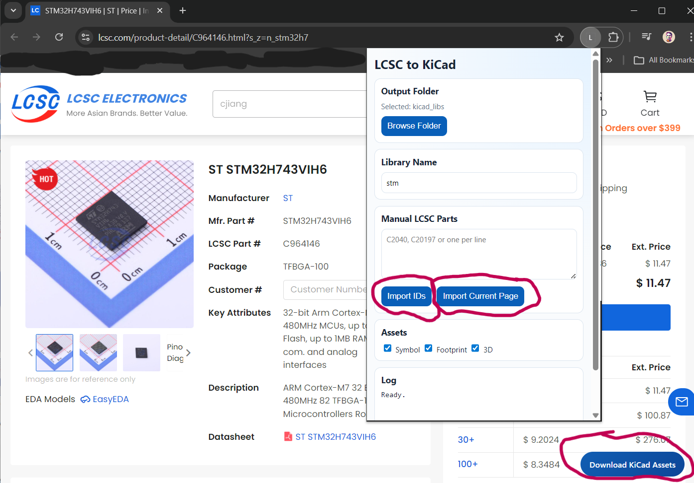

# Chrome Extension: LCSC to KiCad

This folder contains a standalone Chrome Manifest V3 extension that starts the browser-only import flow for LCSC/EasyEDA parts.

## 3 ways to import 

## Current implementation status

Implemented now:
- LCSC page floating button to trigger import of detected part ID.
- Popup UI for manual multi-ID input.
- Project-folder browse and persistent folder handle storage.
- Background fetch pipeline for EasyEDA component JSON and 3D STEP downloads.
- Output writer for project layout:
  - `<library>.kicad_sym`
  - `<library>.pretty/*.kicad_mod`
  - `<library>.3dshapes/*`
  - `_easyeda_raw/*.json`
- Symbol conversion now uses parsed EasyEDA data (pins, text, and core geometry) and writes into a shared symbol library with replace-if-exists behavior.
- Footprint conversion now parses EasyEDA footprint shapes (pads, drills, tracks, arcs, circles, text, and solid regions) instead of writing placeholders.
- Symbol `Footprint` property now references the generated footprint name from package metadata, so symbol and footprint stay correlated.
- 3D model handling is STEP-only for now:
  - Extension downloads `.step`
  - Footprint `model` section points to `.step`
  - No `.wrl` conversion in current extension implementation

Important:
- Extension conversion behavior is being aligned with the Python pipeline in phases.
- Remaining major parity item: OBJ to WRL conversion (if WRL output is needed).

## 3D model path format

For project-specific libraries, the extension writes footprint model paths as:

`\${KIPRJMOD}/<output-folder>/<library>.3dshapes/<model>.step`

Example:

`\${KIPRJMOD}/kicad_libs/cobacoba2.3dshapes/BULETM-SMD_ESP32-PICO-MINI-02-N8R2.step`

Where:
- `<output-folder>` is the folder chosen in popup Browse Folder.
- `<library>` is the popup library name.

## Load in Chrome

1. Open `chrome://extensions`.
2. Enable Developer Mode.
3. Click Load unpacked and select this `chrome-extension` folder.
4. Open popup, click Browse Folder, choose a project folder.
5. Use manual IDs or open an LCSC part page and click Download KiCad Assets.

## Next tasks

- Complete remaining symbol parity details (advanced path/bezier and multi-unit edge cases).
- Complete remaining footprint parity details (additional edge-case command variants).
- Add optional OBJ to WRL conversion for users who require WRL output.
- Expand conversion parity tests with fixture LCSC parts.
